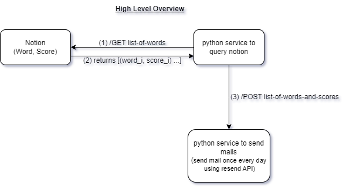
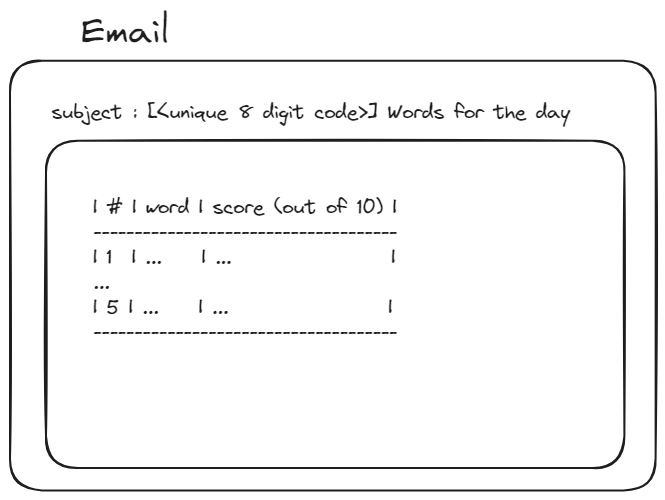
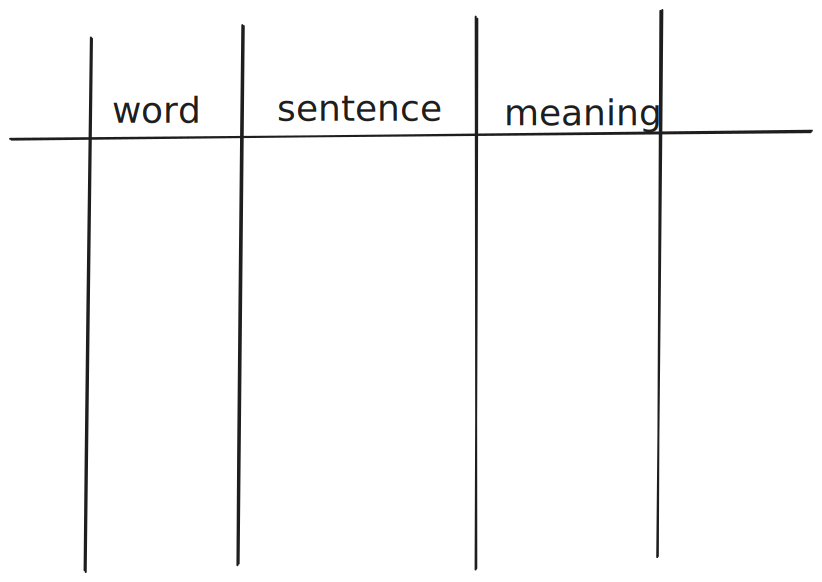
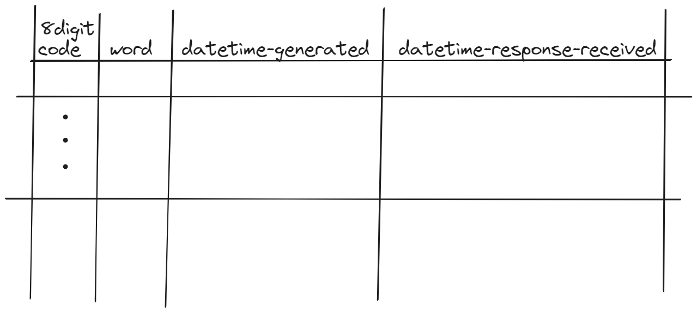

# word-wise
english vocab learning tool for personal use

The user creates the following excel based on the given words :

name the excel file as `<8-digit-unique-code>.xlsx`

NOTE : a given word can appear in the above excel mutiple times. This is useful for homonyms.

Upload the excel back on the webportal. The form submission will trigger a python script to update the notion words database with updated score = original score + 1 (with additional check that score < 10 always), and add the meaning(s) and sentences(s) for each word will be added plaintext on the word page on notion.

Logs are stored in a local sqlite database in the following format

